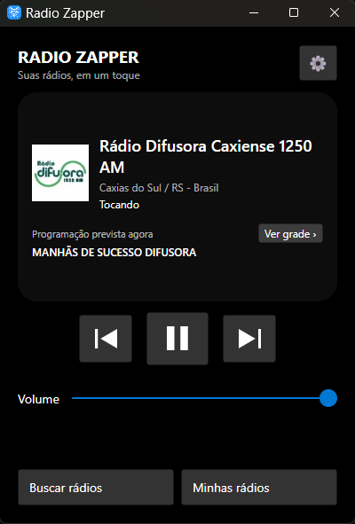
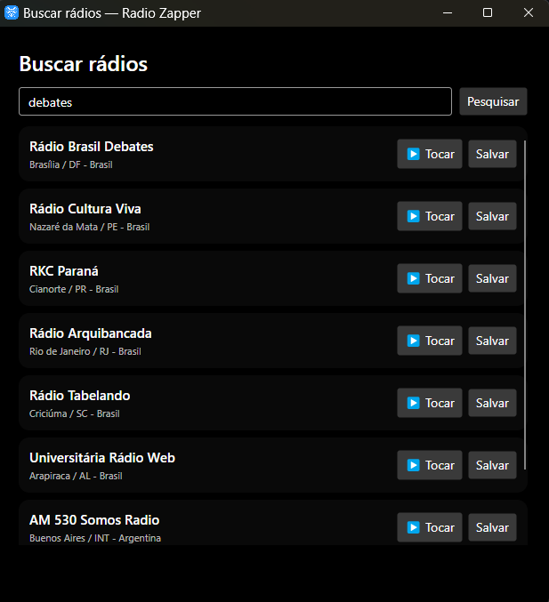

# Radio Zapper

Player de rádios online para Windows, feito com C# e Avalonia UI. Reproduza suas estações favoritas em uma janela compacta ou controle o áudio pelas teclas multimídia e pela bandeja do sistema.

## Capturas de tela

### Tela inicial



### Busca de rádios



## Recursos

- Organize suas estações, marque favoritas e adicione logotipos.
- Veja a programação atual e a grade semanal das rádios vinculadas, quando disponíveis.
- Controle reprodução, volume e troca de estação pela interface, bandeja do Windows ou teclas multimídia.
- Escolha o tema e configure o comportamento ao minimizar ou fechar a janela.

## Executar

Requisitos: Windows x64 e [SDK do .NET 10](https://dotnet.microsoft.com/download/dotnet/10.0).

```powershell
dotnet restore
dotnet run --project RadioZapper.csproj
```

Para compilar ou publicar, execute `compilar.bat` e escolha a opção no menu. A publicação fica em `bin\publish-win-x64-sem-runtime` e exige o runtime do .NET 10 x64 no computador de destino. Distribua **a pasta inteira**, incluindo `libvlc\win-x64`, para que o áudio funcione.

## Dados locais

As estações, configurações e cópias dos logotipos ficam em `%LOCALAPPDATA%\RadioZapper`. O aplicativo usa arquivos JSON e não exige conta.

## Tecnologias

.NET 10, Avalonia UI, CommunityToolkit.Mvvm e LibVLCSharp.
